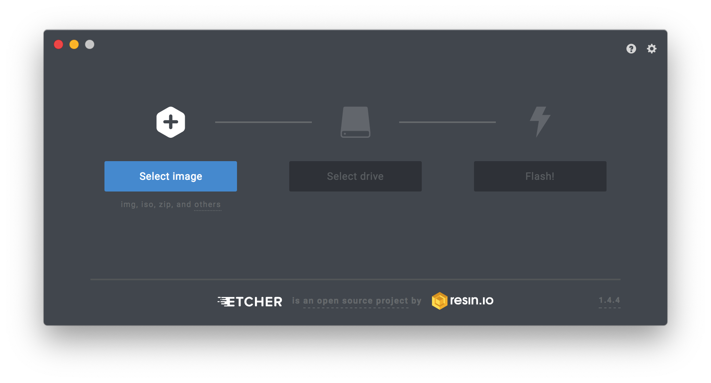
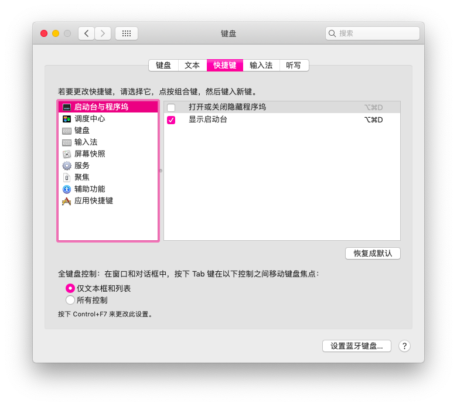
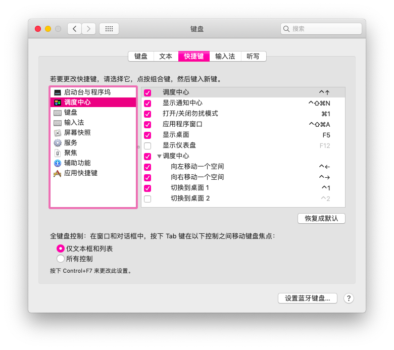

# 联想拯救者R720黑苹果Mojave简易教程

> #### 简单记录下R720黑苹果的过程，希望让更多人吃上黑苹果，同时也能避开一些坑。

##  机型配置信息

|   项目   |         详细参数          |
| :------: | :-----------------------: |
|   型号   |   联想拯救者R720-15IKBN   |
|   CPU    | Intel Kaby Lake i5 7300HQ |
|   内存   |     DDR4 16G 2400MHz      |
|   显卡   |  核显HD630@独显GTX1050Ti  |
|   硬盘   | 希捷1T机械硬盘ST1000LM035 |
| 固网网卡 |    Realtek RTL8111GUL     |
| 无线网卡 |      Atheros QCA9377      |
|   LCD    |         1920*1080         |
|  触摸板  |           ELAN            |

## 更新

> #### 8月17更新：更新Clover版本，删减不需要的kexts，优化文件结构

## 已经驱动

* ####  核显HD630(独显暂时无解，已屏蔽)

* #### 声卡使用VooDooHDA驱动，扬声器/耳机/蓝牙输出可自行切换

* #### 键盘快捷键可使用`Cap+Shift+F1/F2...`,可调节音量和亮度，小键盘可用

* #### 通过更改偏好设置>键盘>快捷键可支持大部分触摸板手势

* #### USB3.0/2.0

* #### 摄像头可正常使用(只是像素很感人。。)

## 目前存在的问题

* #### 蓝牙可使用，但无法关闭，且连接蓝牙音箱时声音可能会卡顿。。。

* #### CPU睡眠后唤醒系统会变得极度卡顿，重启后正常，推荐[关闭睡眠](https://support.apple.com/zh-cn/HT200106)

## 无法驱动

* #### 独显GTX1050Ti。Nvidia Web Driver 最高支持到`HighSierra 10.13.6`，核显其实已满足日常使用

* #### WIFI无解，需要的可自行更换博通网卡。常用型号`DW1830`（`BCM 94360`）、`DW1560`（`BCM 94352z`）、`DW1830`，购买前请自行查询你的机器是否够位置。

## 相关截图

## 准备工作

### *建议在安装黑苹果前可以先去论坛爬爬楼，比如国内的[远景论坛](http://bbs.pcbeta.com/forum.php?gid=86)、[威锋论坛](http://bbs.feng.com/)和国外的[tonymacx86论坛](https://www.tonymacx86.com/)，遇到具体问题可以看看大家的解决办法，也可以去看大神[黑果小兵的部落阁](https://blog.daliansky.net/)，里面有很多教程。

* #### 装有[WePE](http://www.wepe.com.cn/)或其他PE的U盘，用于调整分区和复制文件(个人推荐使用两个U盘，系统有问题的话还可以进PE抢救一下嘛~~误~~，当然也可以一个U盘用完PE后再刻录Mac镜像)

* #### 8G以上大小的U盘，用于制作mac启动盘

* #### 刻录工具🛠[etcher](https://etcher.io/)

* #### 下载👆上面准备好的EFI文件夹

* #### 苹果镜像，推荐使用黑果小兵制作的💿[镜像](https://blog.daliansky.net/macOS-Mojave-10.14.6-18G87-Release-version-with-Clover-5033-original-image.html)

## 安装简易过程(引用自[黑果小兵教程](https://blog.daliansky.net/MacOS-installation-tutorial-XiaoMi-Pro-installation-process-records.html))

* #### 下载[etcher](https://etcher.io/)，打开镜像，选择U盘，点击Flash即可

  

* #### 双系统安装的请在需要安装的硬盘压缩出足够的空间(推荐120G以上)，不需要新建分区

* #### 重启按`F2`进Bios，关闭安全启动Secure Boot~~(巨硬出来挨打)~~，把AHCI开启，设置好`F10`保存电脑重启

* #### 按`F12`进入PE，如果在需要安装的硬盘(⚠️是物理意义上的硬盘)没有EFI分区或者分区过小，请使用DiskGenius在未分配空间新建一个200M左右大小的EFI分区，尽管你并不打算使用这个EFI分区(大坑)，再新建NTFS分区或HFS+分区(个人测试NTFS格式的分区在Mac的磁盘工具是可以格式化的)，如果所在磁盘没有200M左右的EFI分区可能会在安装时出现分区无法格式化的问题

* #### 重启`F12`选择刻录好的Mac安装盘，进入引导，选择“Boot macOS Install from Install macOS Mojave”启动安装，选择“磁盘工具”进去抹盘，选择好要安装的分区然后点上面的抹掉。名称自己起一个，格式选`APFS`，然后点击抹掉。这一步完成后关闭页面，选择“安装macOS”，接下的安装不多说了，等安装好后重启，因为引导还在U盘上，重启后`F12`选择U盘启动，可以看到多了一个系统，选择进入完成后续的设置。

* #### 刚装好的系统很多硬件都没有进行驱动，下载CLOVER配置工具[Clover Configurator](https://mackie100projects.altervista.org/)挂载U盘EFI分区，将下载的EFI文件替换进去，重启后继续U盘启动，如果能正常启动且硬件详情信息正常，应该就可以正常使用黑苹果了

* #### 这时候可以再次进入Clover Configurator挂载系统的EFI分区和U盘的EFI分区，将U盘的CLIOVER文件夹复制到系统EFI分区下的EFI文件夹下，如果是单Mac系统，直接复制EFI文件夹进系统的EFI分区

* #### (双系统引导修复)进入window系统，安装EasyUEF企业版或者BOOTICE，添加启动项，选择CLOVERX64.efi，确定后将启动项调整到第一位置，重启后就自动进入Clover引导了，不需要U盘引导。具体可以参考[双系统引导](http://bbs.pcbeta.com/viewthread-1806802-1-1.html)

* #### 教程结束🔚

* #### 对了，触控板手势需要设置键盘的快捷键，具体如下图所示，想要研究的可以参考[无限接近白苹果，AppleSmartTouchPad完善键鼠触控](http://bbs.pcbeta.com/viewthread-1734262-1-1.html)

  

## 相关优化

* #### [一键开启HIDPI教程](https://github.com/xzhih/one-key-hidpi/blob/master/README-zh.md)(1080p用的话推荐最后选1424x802的那项，开启后重启>偏好设置>显示器>缩放>默认，超过900像素的好像会有问题)

* #### [关闭睡眠](https://support.apple.com/zh-cn/HT200106)

## 一些推荐

* #### 相关的一些博客：[黑果小兵的部落阁](https://blog.daliansky.net/)、[醉渔小站](https://zuiyu1818.cn/)、[唐少游的黑苹果从入门到精通](https://post.smzdm.com/xilie/40890/)、 [云屋小站](https://www.misonsky.cn/ )

### 暂时就是这样了，虽然还有些问题，但日常使用是没问题的，后续有时间再继续完善。。。

## 小声BB

> #### 黑苹果本身就很难和白苹果有一样的体验，尤其是笔记本，很难做到完美，个人觉得，只要足够日常的使用，没有特别明显的问题基本就差不多了，过度追求完美反而会忘记原本的目的，虽然本人有时会很强迫症，很想做到完美🙄